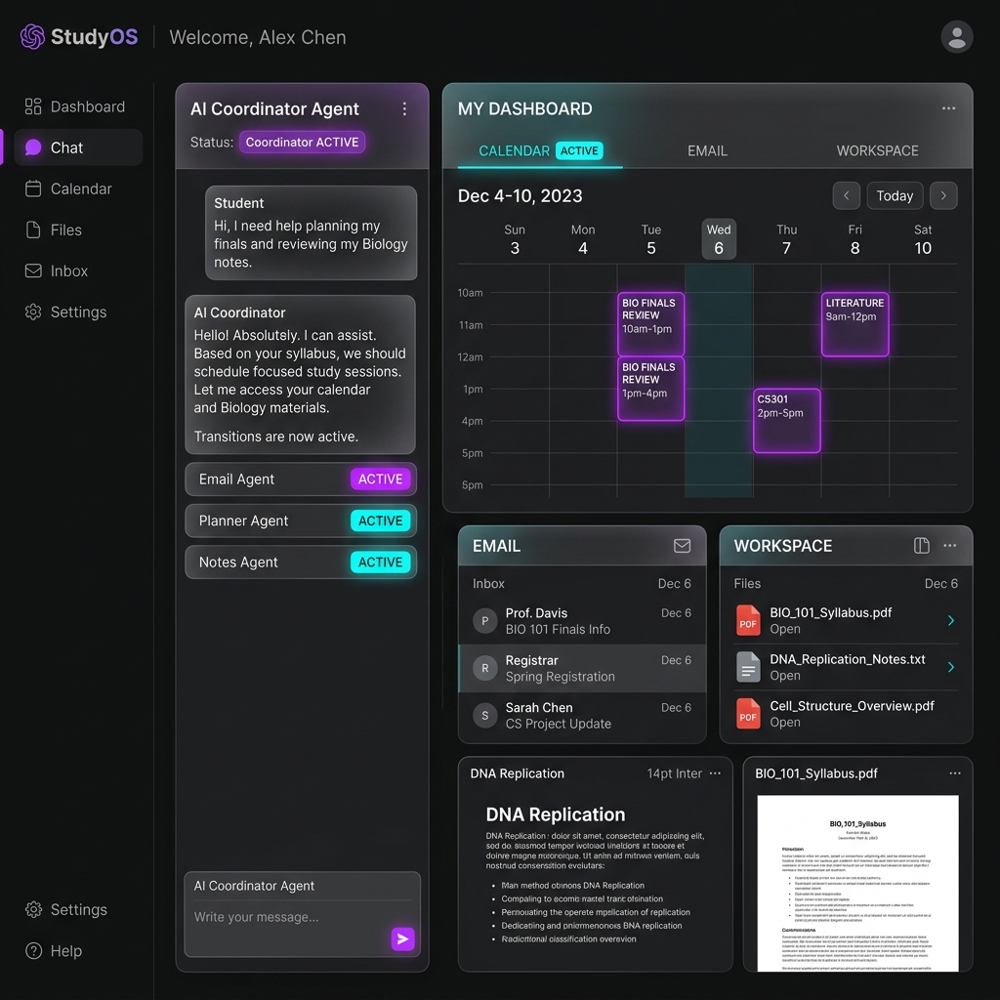

# StudyOS 🎓🤖

StudyOS is an AI-powered **Academic Operating System** designed to streamline a student's academic life. By leveraging a multi-agent system powered by the **Google Agent Development Kit (ADK)** and the Gemini API, StudyOS integrates with simulated student tools—inboxes, filesystem-based notes, and study calendars—to dynamically orchestrate exam preparation, track assignment deadlines, search study notes, and schedule study blocks.

---

## 🖥️ Dashboard Mockup

Below is a preview of the StudyOS interface, showcasing the interactive chat with the Academic Coordinator, the integrated student calendar, recent inbox emails, and academic notes.



---

## 🌟 Key Features

1. **Multi-Agent Orchestration**: Powered by Google ADK. A central `CoordinatorAgent` acts as the router and task planner, delegating specific sub-tasks to specialized sub-agents.
2. **Email Extraction (`EmailAgent`)**: Communicates with a custom MCP email toolset to parse inbox messages, identify midterms/finals, and extract assignment deadlines.
3. **Smart Study Notes (`NotesAgent`)**: Interfaces with a custom MCP filesystem toolset to list, search, and read academic study notes (supporting both plaintext files and PDFs).
4. **Calendar Planner (`PlannerAgent`)**: Interfaces with a custom MCP calendar toolset to search calendars, find free time slots, and schedule conflict-free study blocks.
5. **Real-time Telemetry Dashboard**: A logging panel on the frontend that displays active agent transitions, tool invocations, and responses as they stream from the server.
6. **Streaming Chat (SSE)**: Powered by FastAPI Server-Sent Events (SSE), offering instant, word-by-word streaming responses and fluid state updates.

---

## 🔄 Agentic Workflow & Architecture

The multi-agent system utilizes a hub-and-spoke sequence where the `CoordinatorAgent` directs control to specialized agents. Sub-agents execute their tasks using Model Context Protocol (MCP) servers and return results back to the Coordinator, avoiding complex peer-to-peer routing and keeping control flows deterministic.

```mermaid
sequenceDiagram
    autonumber
    actor Student as Student (UI)
    participant Coord as CoordinatorAgent (LlmAgent)
    participant Email as EmailAgent (LlmAgent)
    participant Notes as NotesAgent (LlmAgent)
    participant Planner as PlannerAgent (LlmAgent)
    participant MCP as MCP Servers (Email, FS, Calendar)

    Student->>Coord: "I have a DBMS exam next week. Help me prepare."
    Note over Coord: Detects intent, checks history for details.
    
    rect rgb(30, 30, 46)
        Note right of Coord: Stage 1: Fetch Exam Details
        Coord->>Email: Transfer Control (requesting exam date/time)
        Email->>MCP: call list_recent_emails()
        MCP-->>Email: return simulated emails
        Email->>MCP: call get_email_details(email_id)
        MCP-->>Email: return exam announcement
        Email-->>Coord: Return exam date (e.g. July 10th) & Transfer Control
    end

    rect rgb(40, 40, 60)
        Note right of Coord: Stage 2: Extract Syllabus Topics
        Coord->>Notes: Transfer Control (requesting DBMS notes)
        Notes->>MCP: call list_notes() / search_notes()
        MCP-->>Notes: return matching files (e.g. DBMS_Syllabus.txt)
        Notes->>MCP: call read_note(DBMS_Syllabus.txt)
        MCP-->>Notes: return text content of note
        Notes-->>Coord: Return syllabus topics & Transfer Control
    end

    rect rgb(30, 30, 46)
        Note right of Coord: Stage 3: Calendar Scheduling
        Coord->>Planner: Transfer Control (exam date, topics, duration)
        Planner->>MCP: call list_events() / find_free_time()
        MCP-->>Planner: return available time slots
        Planner->>MCP: call create_event("Study DBMS: Joins", start_time, end_time)
        MCP-->>Planner: return success status
        Planner-->>Coord: Return scheduled block details & Transfer Control
    end

    Coord-->>Student: Stream synthesized study plan and calendar confirmation
```



---

## 🛠️ Technology Stack

* **Frontend**: React, Vite, TailwindCSS (for sleek layouts), Lucide React (for UI icons).
* **Backend**: FastAPI, Uvicorn, Pydantic, PyPDF (for reading PDF note uploads).
* **Agent Framework**: Google Agent Development Kit (ADK) `LlmAgent` and `InMemoryRunner`.
* **LLM Engine**: Gemini API (`gemini-2.5-flash` by default).
* **Protocol**: Model Context Protocol (MCP) servers run over stdio for Email, Filesystem, and Calendar simulation.

---

## 📂 Project Structure

```
StudyOS/
├── agents/
│   ├── agents.py           # Programmatic rule-based agents
│   └── agents_multi.py     # ADK LlmAgent setup (Coordinator, Email, Notes, Planner)
├── assets/
│   └── study_os_dashboard_mockup.png  # UI Dashboard mockup
├── backend/
│   ├── main.py             # FastAPI App, SSE endpoints, and static file endpoints
│   └── .env                # Local backend environment
├── config/
│   ├── settings.py         # Global project configuration settings
│   ├── simulated_calendar.json  # Simulates student calendar events
│   └── simulated_emails.json    # Simulates student academic inbox
├── frontend/
│   ├── src/
│   │   ├── App.jsx         # Main React SPA interface
│   │   ├── index.css       # Design system and typography styles
│   │   └── main.jsx        # App entry point
│   ├── package.json        # Frontend configuration and script list
│   └── vite.config.js      # Vite build parameters
├── mcp/
│   ├── mcp_calendar.py     # MCP Server for calendar events
│   ├── mcp_email.py        # MCP Server for simulated email access
│   └── mcp_filesystem.py   # MCP Server for files/notes manipulation
└── workspace/              # Student study notes folder (PDFs/TXTs)
```

---

## 🚀 Running StudyOS Locally

### 1. Prerequisites
* Python 3.10+
* Node.js v18+
* A Google Gemini API Key

### 2. Environment Setup
Create a `.env` file in the root of the project (and/or under `backend/.env`) with your API key:
```env
GEMINI_API_KEY=your_gemini_api_key_here
GEMINI_MODEL=gemini-2.5-flash
PORT=8000
HOST=127.0.0.1
```

### 3. Start the Backend Server
From the project root:
```bash
# 1. Install dependencies
pip install fastapi uvicorn google-genai python-dotenv mcp pydiff pypdf

# 2. Start the backend FastAPI server
python backend/main.py
```
The backend server will run on `http://127.0.0.1:8000`.

### 4. Start the Frontend Dev Server
In a new terminal, navigate to the `frontend/` directory:
```bash
# 1. Install packages
npm install

# 2. Run the Vite development server
npm run dev
```
Open `http://localhost:5173` in your browser to interact with StudyOS!

---

## 🤝 Contributing

Contributions are welcome! If you have suggestions or want to add features (like connecting to live Gmail, Google Calendar, or Notion APIs), please fork this repository and create a Pull Request.
